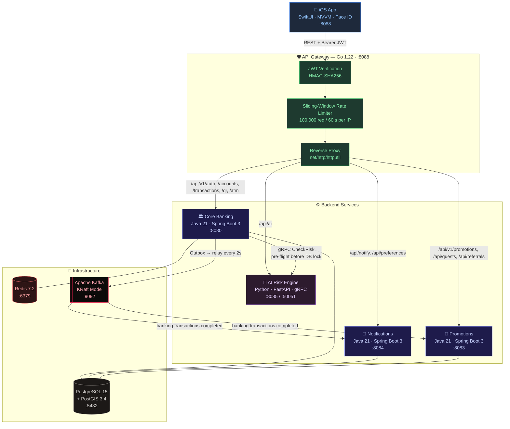
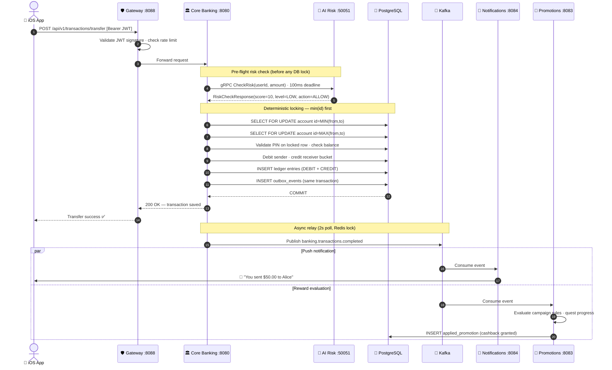

<div align="center">

# 🏛️ Titan Banking — Full-Stack Distributed Microservices Platform

**Go · Java 21 · Python · Swift · Apache Kafka · gRPC · PostgreSQL · Redis · iOS**

<br/>

<a href="https://openjdk.org/"></a>
<a href="https://spring.io/"></a>
<a href="https://golang.org/"></a>
<a href="https://python.org/"></a>
<a href="https://swift.org/"></a>
<a href="https://kafka.apache.org/"></a>
<a href="https://grpc.io/"></a>
<a href="https://www.postgresql.org/"></a>
<a href="https://redis.io/"></a>
<a href="https://docker.com/"></a>

<br/>

> A full-stack distributed banking platform built with **7 independent services** across 4 languages — orchestrated via event-driven Kafka streaming, real-time gRPC fraud detection, and a native iOS banking app.

<br/>

**[Demo](#demo) · [Architecture](#system-architecture) · [Services](#services-overview) · [Transfer Flow](#transfer-flow-end-to-end) · [iOS App](#ios-banking-app) · [Quick Start](#quick-start) · [API Testing](#api-testing)**

</div>

---

## Demo

**iOS App — Live Walkthrough**

[](https://www.youtube.com/watch?v=ZK7f0ASDNAI)

> Click the thumbnail to watch the full iOS app demo on YouTube.

The video walks through the complete native banking experience running on iPhone simulator against the full Docker Compose backend stack:

- Face ID / Touch ID biometric login
- Live balance dashboard with multi-currency accounts
- End-to-end money transfer flow with PIN confirmation
- KHQR code generation and camera-based QR scanning
- ATM cardless withdrawal code generation
- In-app notification center showing real-time transaction alerts
- Promotions, cashback, and quest progress
- Loan management and fixed deposit overview

---

## Table of Contents

- [Demo](#demo)
- [What This Project Is](#what-this-project-is)
- [Technology Stack](#technology-stack)
- [System Architecture](#system-architecture)
- [Services Overview](#services-overview)
  - [Titan Gateway — Go](#1-titan-gateway--go)
  - [Titan Core Banking — Java 21](#2-titan-core-banking--java-21)
  - [Titan AI Risk Engine — Python](#3-titan-ai-risk-engine--python)
  - [Titan Notifications — Java 21](#4-titan-notifications--java-21)
  - [Titan Promotions — Java 21](#5-titan-promotions--java-21)
  - [Titan Event Consumer Lib — Java 21](#6-titan-event-consumer-lib--java-21)
  - [Titan iOS App — Swift / SwiftUI](#7-titan-ios-app--swift--swiftui)
- [Transfer Flow — End to End](#transfer-flow-end-to-end)
- [Kafka Topics](#kafka-topics)
- [Gateway Routing Table](#gateway-routing-table)
- [iOS Banking App](#ios-banking-app)
- [Infrastructure](#infrastructure)
- [Quick Start](#quick-start)
- [API Testing](#api-testing)
- [Project Structure](#project-structure)

---

## What This Project Is

Titan Banking is a portfolio project built to demonstrate how a real-world fintech platform handles:

- **High-concurrency financial transactions** without deadlocks or double-spends
- **Event-driven architecture** where downstream services (notifications, rewards) never slow down a money transfer
- **Real-time fraud detection** via gRPC — risk is evaluated before any database row lock is held
- **Multi-language microservices** — Go for the gateway, Java for business logic, Python for AI, Swift for mobile
- **Production patterns** — Outbox, Saga, DLQ, Circuit Breaker, Idempotency, Pessimistic Locking, PostGIS geofencing

Each service is independently deployable, has its own database, and communicates only through the API Gateway (synchronous) or Kafka (asynchronous).

---

## Technology Stack

| Layer | Technology | Version | Purpose |
|:---|:---|:---:|:---|
| **API Gateway** | Go + `net/http/httputil` | 1.22 | Reverse proxy, JWT validation, sliding-window rate limiter |
| **Core Banking** | Java 21 Virtual Threads + Spring Boot | 3.2.3 | Accounts, transfers, QR payments, ATM codes |
| **AI Risk Engine** | Python + FastAPI + gRPC | 3.11 | Real-time fraud scoring, risk event persistence |
| **Notifications** | Java 21 + Spring Boot + Kafka Consumer | 3.2.3 | Push, SMS, Email alerts via Twilio / SendGrid / APNs |
| **Promotions** | Java 21 + Spring Boot + PostGIS | 3.2.3 | Cashback, quests, referrals, geofenced merchant campaigns |
| **Shared Lib** | Java 21 + Spring Kafka | 3.1.2 | Reusable Kafka consumer base class, DLQ routing |
| **iOS App** | Swift 5.10 + SwiftUI + Combine | iOS 17+ | Native banking client, Face ID, QR scanner, KHQR |
| **Message Broker** | Apache Kafka KRaft (no Zookeeper) | 7.6.0 | Async event streaming between services |
| **Database** | PostgreSQL 15 + PostGIS 3.4 | — | ACID transactions, geospatial merchant indexing |
| **Cache** | Redis 7.2 | — | Idempotency keys, distributed locks, session cache |
| **RPC** | gRPC + Protocol Buffers | 1.76.0 | Core Banking → AI Risk Engine (sub-10ms latency) |
| **Fault Tolerance** | Resilience4j | 2.2.0 | Circuit Breaker, Retry, Bulkhead across all Java services |
| **Observability** | Micrometer + Prometheus + Grafana | — | Metrics, Kafka dashboard |
| **Build** | Maven 3.9 (parent POM) | — | Unified multi-module build for all Java services |
| **Containerization** | Docker Compose | — | One command to run the full 8-service stack |

---

## System Architecture



---

## Services Overview

### 1. Titan Gateway — Go

**Path:** `Titan-gateway-go/` · **Port:** `8088` · **Language:** Go 1.22

The single entry point for all traffic. Nothing reaches a backend service without passing through here.

**What it does:**
- **Stateless JWT validation** — verifies HMAC-SHA256 signatures in memory on every request, no database round-trip
- **Sliding-window rate limiter** — tracks per-IP request timestamps in a `sync.Map`; blocks IPs exceeding 100,000 req/60s
- **IP jail** — blocked IPs are rejected instantly without further processing for the configured block duration
- **Reverse proxy** — uses Go's `net/http/httputil.ReverseProxy` with automatic header enrichment (`X-Gateway`, `X-Real-IP`, `X-Forwarded-Host`)
- **Config-driven routing** — upstream targets loaded from `config.yaml` with `${ENV_VAR}` expansion at runtime
- **Graceful shutdown** — listens for `SIGTERM`/`SIGINT`, drains in-flight requests before exiting

```go
// Deterministic lock-free rate limiter — from main.go
type slidingWindowLimiter struct {
    mu          sync.Mutex
    states      map[string]*ipState  // per-IP timestamp ring
    maxRequests int
    window      time.Duration
    blockDur    time.Duration
}
```

**Public routes** (no JWT required): `/api/v1/auth/**`, `/api/auth/otp/**`, `/health`

---

### 2. Titan Core Banking — Java 21

**Path:** `Titan-core-bank/` · **Port:** `8080` · **Language:** Java 21 + Spring Boot 3.2.3

The central ledger engine. See [`Titan-core-bank/README.md`](Titan-core-bank/README.md) for full technical deep-dive.

**Key technical features:**
- **Java 21 Virtual Threads** (`spring.threads.virtual.enabled=true`) — 10,000+ concurrent requests without thread pool exhaustion
- **Deterministic lock ordering** — acquires PostgreSQL row locks in ascending ID order on every transfer, eliminating deadlocks (0 deadlocks across 1,968 concurrent operations in k6 load tests)
- **Balance bucket partitioning** — 8 sub-bucket rows per account for hot merchant account scalability
- **Transactional Outbox** — events written to `outbox_events` in the same DB transaction as the transfer; `OutboxRelayService` polls every 2s and publishes to Kafka
- **Pre-flight gRPC risk check** — AI service called before any row lock is acquired; 100ms hard deadline with Resilience4j circuit breaker fallback
- **Pessimistic QR lock** — `PESSIMISTIC_WRITE` + 3s timeout on QR token row prevents double-spend
- **Double-entry ledger** — every transfer creates balanced DEBIT + CREDIT `LedgerEntry` rows
- **IDOR protection** — `@PreAuthorize("@accountSecurity.isAccountOwner(...)")` on every account endpoint
- **25 Flyway migrations** — versioned schema from V1 (init) through V26 (ATM codes)

---

### 3. Titan AI Risk Engine — Python

**Path:** `titan-ai-service/` · **Ports:** `8085` (HTTP) / `50051` (gRPC) · **Language:** Python 3.11

Dual-mode service: gRPC for synchronous in-flight transaction scoring, FastAPI for async reporting.

**Risk scoring table:**

| Amount | Score | Level | Action |
|:---|:---:|:---:|:---:|
| < $1,000 | 10 | LOW | ALLOW |
| $1,000 – $9,999 | 50 | MEDIUM | REVIEW |
| ≥ $10,000 | 100 | BLOCKED | BLOCK ⛔ |

**gRPC contract** (`risk_engine.proto`):
```protobuf
service RiskEngineService {
  rpc CheckRisk (RiskCheckRequest) returns (RiskCheckResponse);
}
message RiskCheckRequest  { string user_id = 1; double amount = 2; }
message RiskCheckResponse { int32 risk_score = 1; string risk_level = 2; string action = 3; }
```

**Persistence:**
- Every `CheckRisk` call → persisted to `titan_systemdb.risk_events`
- Every `BLOCK` decision → additionally persisted to `titan_systemdb.blocked_transfers`

**HTTP reporting endpoints** (port 8085):

| Method | Endpoint | Description |
|:---:|:---|:---|
| `GET` | `/health` | Service liveness |
| `GET` | `/api/reports/risk` | Paginated risk event log |
| `GET` | `/api/reports/blocked` | Blocked transfer log |
| `GET` | `/api/reports/stats` | Aggregated risk statistics |
| `GET` | `/api/reports/stats/daily` | Daily summary |
| `POST` | `/api/reports/generate` | Trigger report generation |

**Dependencies:** `grpcio 1.76`, `fastapi 0.115.5`, `uvicorn 0.32.1`, `psycopg2-binary 2.9.10`, `pydantic 2.10.3`

---

### 4. Titan Notifications — Java 21

**Path:** `Titan-notifications-service/` · **Port:** `8084` · **Language:** Java 21 + Spring Boot 3.2.3

Asynchronous, event-driven notification dispatcher. Never called directly by Core Banking — only consumes Kafka events.

**Key technical features:**
- **Kafka consumer group** `notification-service-group` → topic `banking.transactions.completed`
- **Multi-channel strategy pattern** — pluggable providers with automatic failover:
  - SMS: Twilio (primary) → AWS SNS (fallback)
  - Email: SendGrid (primary) → AWS SES (fallback)
  - Push: Apple APNs + Firebase FCM
- **FreeMarker templates** — HTML email and SMS rendered from `.ftl` templates; i18n support for English (`messages_en.properties`) and Khmer (`messages_km.properties`)
- **DLQ consumer** — `DlqConsumer` replays dead-letter messages; `DlqConsumer` forwards to `banking.notifications.dlq` after retry exhaustion
- **PII redaction** — `PiiRedactionFilter` strips phone numbers, email addresses, and account numbers from log output
- **APNs integration** — `ApnsPushService` handles Apple Push Notification service with device token management
- **Predictive delivery** — `PredictiveDeliveryService` batches low-urgency notifications to reduce provider API calls
- **Spring Batch archival** — nightly `ArchivalBatchConfig` archives delivered notifications to cold storage

**REST endpoints:**

| Method | Endpoint | Description |
|:---:|:---|:---|
| `POST` | `/api/notify/send` | Direct programmatic notification dispatch |
| `GET` | `/api/preferences/{userId}` | Get user notification preferences |
| `PUT` | `/api/preferences/{userId}` | Update opt-in settings |
| `GET` | `/api/audit/logs` | Delivery status audit trail |
| `POST` | `/api/webhooks/{provider}` | Delivery receipt webhook (SendGrid, Twilio) |

---

### 5. Titan Promotions — Java 21

**Path:** `Titan-promotions-service/` · **Port:** `8083` · **Language:** Java 21 + Spring Boot 3.2.3

Reward engine with the richest internal architecture of any service in the platform.

**Key technical features:**
- **Kafka consumer** `TransactionEventConsumer` → topic `banking.transactions.completed`
- **Rule engine** (`RuleEngine.java`) — evaluates campaign eligibility conditions against transaction attributes
- **Quest state machine** — Spring State Machine with states `LOCKED → IN_PROGRESS → COMPLETED → REWARD_CLAIMED`
- **PostGIS geofencing** — `GeoSpatialTriggerService` queries `geometry(Point, 4326)` spatial indexes to trigger merchant campaigns when users transact within defined radius
- **Referral graph** (`ReferralGraphService`) — multi-tier referral tracking; rewards propagate up the graph to referring users
- **Deposit promotion** (`DepositPromotionService`) — evaluates 9 Flyway-versioned campaign rules including time-boxed bonus campaigns (V7, V9)
- **Shadow rule engine** — `ShadowRuleEngine` runs new rules in parallel with production rules to validate before promotion
- **A/B testing** — `ABTestingService` splits users into cohorts for campaign experiment evaluation
- **Saga compensation** — `RewardSagaCompensator` reverses reward grants if downstream confirmation fails
- **Reward clawback** — `ClawbackService` reclaims rewards on transaction reversal or fraud detection
- **Outbox pattern** — `OutboxProcessor` publishes `RewardGrantedEvent` to Kafka reliably
- **WebAssembly rules** — `WasmExportService` exports rule logic as `.wat` for portable execution
- **Budget monitoring** — `BudgetMonitorService` enforces campaign spend limits with atomic Redis counters
- **Dynamic pricing** — `DynamicPricingService` adjusts cashback rates based on user behavior aggregation from Kafka Streams

**9 Flyway migrations:** V1 (init) → V2 (campaign rules) → V5 (advanced features) → V6–V9 (deposit bonus campaigns)

**REST endpoints:**

| Method | Endpoint | Description |
|:---:|:---|:---|
| `GET` | `/api/v1/promotions/active` | Active campaigns and cashback offers |
| `POST` | `/api/v1/promotions/claim` | Claim eligible reward or voucher |
| `GET` | `/api/quests` | Customer quests and progress |
| `POST` | `/api/quests/{questId}/claim` | Collect quest reward |
| `GET` | `/api/referrals/my-code` | Get referral invite code |
| `GET` | `/api/referrals/stats` | Referral hierarchy and earnings |
| `GET` | `/api/v1/promotions/deposit-bonus/status` | Check deposit bonus eligibility |

---

### 6. Titan Event Consumer Lib — Java 21

**Path:** `titan-event-consumer-lib/` · **Type:** Shared Maven library

A reusable Spring Kafka library included by both `Titan-notifications-service` and `Titan-promotions-service`.

**What it provides:**

`BaseEventConsumer<T>` — abstract generic consumer with:
- Pre-configured JSON deserialization with type-safe binding
- MDC context propagation for distributed trace correlation
- Structured exception boundaries — deserialization errors, business errors, and fatal errors handled separately

`DLQProducer` — sends failed messages to the appropriate dead-letter topic:
- Unparseable payloads → `banking.transactions.dlq`
- Fatal consumer errors → `banking.transactions.poison`

`KafkaConsumerConfig` — standardized consumer factory with:
- Configurable concurrency, backoff retry, and ack mode
- PLAINTEXT/SSL negotiation via Spring properties

**Usage in a new service:**

```xml
<dependency>
    <groupId>com.titan</groupId>
    <artifactId>titan-event-consumer-lib</artifactId>
    <version>0.0.1-SNAPSHOT</version>
</dependency>
```

```java
@Component
public class MyConsumer extends BaseEventConsumer<TransactionCompletedEvent> {
    @Override
    protected void handleEvent(TransactionCompletedEvent event) {
        // business logic here — DLQ routing handled by base class
    }
}
```

---

### 7. Titan iOS App — Swift / SwiftUI

**Path:** `Titan-frontend-ios/` · **Target:** iOS 17+ · **Language:** Swift 5.10 + SwiftUI + Combine

A production-quality native banking client. All requests route through the API Gateway — no service is called directly.

**Architecture:**
- **MVVM** — ViewModels own all state and network calls; Views are pure SwiftUI rendering
- **`async/await`** — modern Swift concurrency throughout; no Combine publishers in the network layer
- **Single gateway entry point** — `APIClient.shared` automatically targets `localhost:8088` on Simulator and `10.30.0.53:8088` on physical device
- **Keychain storage** — JWT tokens stored via `TokenStorage.swift` using Apple Keychain, never `UserDefaults`
- **Face ID / Touch ID** — biometric auth via `LocalAuthentication` framework in `AuthViewModel`

**15 feature modules:**

| Module | Files | Features |
|:---|:---|:---|
| **Auth** | `LoginView`, `RegisterView`, `AuthViewModel` | Face ID login, registration, JWT management |
| **Dashboard** | `DashboardView` | Balance cards, quick actions, transaction feed |
| **Accounts** | `AccountsView`, `AccountViewModel` | Multi-currency account list and detail |
| **Transactions** | `TransferFlowView`, `TransactionsView`, `TransactionViewModel` | Transfer flow, history, filters |
| **QR** | `QrGenerateView`, `QrScannerView`, `QrPayFlowView`, `QrViewModel` | KHQR generate, camera scanner, payment confirmation |
| **ATM** | `AtmWithdrawView`, `AtmRedeemView`, `AtmViewModel` | Cardless withdrawal code generation and redemption |
| **Notifications** | `NotificationsView`, `NotificationsViewModel` | In-app notification center with real-time polling |
| **Promotions** | `PromotionsView`, `PromotionViewModel`, `MerchantCampaignsSection` | Active campaigns, merchant offers, cashback display |
| **Loans** | `LoansView`, `LoanViewModel` | Loan listing, application, repayment schedule |
| **Fixed Deposit** | `FixedDepositView`, `FixedDepositViewModel` | FD creation and maturity tracking |
| **Scheduled** | `ScheduledTransferView`, `ScheduledTransferViewModel` | Recurring transfer setup |
| **International** | `InternationalTransferView`, `InternationalTransferViewModel` | SWIFT/IBAN cross-border transfers |
| **OTP** | `OtpGenerateView`, `OtpViewModel` | One-time PIN generation for sensitive operations |
| **Statements** | `StatementDownloadView`, `StatementViewModel` | PDF statement download |
| **Settings** | `SettingsView` | Profile, security, notification preferences |

**Supporting infrastructure:**
- `DesignSystem.swift` — shared colors, fonts, spacing, reusable components
- `SmartCurrencyConverter.swift` — real-time multi-currency display
- `InAppNotificationManager.swift` — overlay banners for live transaction events
- `SimulatorNotificationBridge.swift` — simulates APNs push on Simulator
- `PushNotificationManager.swift` — APNs device token registration

---

## Transfer Flow — End to End



---

## Kafka Topics

| Topic | Producer | Consumers | Purpose |
|:---|:---|:---|:---|
| `banking.transactions.completed` | Core Banking (Outbox) | Notifications, Promotions | Main domain event — transfer, deposit, withdrawal |
| `banking.accounts.created` | Core Banking | — | New account opened |
| `banking.accounts.updated` | Core Banking | — | Account status changes |
| `banking.transactions.dlq` | Event Consumer Lib | — | Failed messages after retry exhaustion |
| `banking.transactions.poison` | Event Consumer Lib | — | Unrecoverable/undeserializable messages |
| `banking.notifications.dlq` | Notifications | — | Notification delivery failures |
| `banking.rewards.granted` | Promotions (Outbox) | Core Banking | Reward confirmation back to core |
| `banking.rewards.acknowledgment` | Core Banking | Promotions | Reward receipt acknowledgment |
| `titan.banking.transactions` | Core Banking | Analytics | Raw transaction stream for analytics |
| `titan.banking.audit` | Core Banking | — | Immutable audit event stream |

All topics: **3 partitions**, **replication factor 1** (single-broker local setup).

---

## Gateway Routing Table

| Path Prefix | Upstream Service | Auth |
|:---|:---|:---:|
| `/api/v1/auth/**` | Core Banking `:8080` | Public |
| `/api/auth/otp/**` | Core Banking `:8080` | Public |
| `/api/v1/accounts/**` | Core Banking `:8080` | JWT |
| `/api/v1/transactions/**` | Core Banking `:8080` | JWT |
| `/api/v1/qr/**` | Core Banking `:8080` | JWT |
| `/api/v1/atm/**` | Core Banking `:8080` | JWT |
| `/api/v1/statements/**` | Core Banking `:8080` | JWT |
| `/api/notify/**` | Notifications `:8084` | JWT |
| `/api/preferences/**` | Notifications `:8084` | JWT |
| `/api/v1/promotions/**` | Promotions `:8083` | JWT |
| `/api/quests/**` | Promotions `:8083` | JWT |
| `/api/referrals/**` | Promotions `:8083` | JWT |
| `/api/ai/**` | AI Risk Engine `:8085` | JWT |
| `/health` | Gateway local | Public |

---

## iOS Banking App

The iOS app connects exclusively through the Gateway on port `8088`. The base URL switches automatically:

```swift
// APIClient.swift
var gatewayURL: String {
    #if targetEnvironment(simulator)
    return "http://localhost:8088"        // Docker on Mac
    #else
    return "http://10.30.0.53:8088"       // Physical device via LAN
    #endif
}
```

**To run on iPhone 17 Pro Max Simulator:**

```bash
# Option A — Xcode
open Titan-frontend-ios/Titan_Banking.xcodeproj
# Select iPhone 17 Pro Max target → Cmd+R

# Option B — CLI
xcodebuild -scheme Titan_Banking \
  -destination 'platform=iOS Simulator,name=iPhone 17 Pro Max' \
  build
```

The app also includes Angkor Wat imagery (`angkor_wat@3x.jpg`) reflecting the Cambodian banking context of the platform.

---

## Infrastructure

### Databases

| Database | Used By | Notes |
|:---|:---|:---|
| `titandb` | Core Banking | 26 Flyway migrations, main ledger |
| `notificationdb` | Notifications | Audit log, user preferences |
| `promotiondb` | Promotions | Campaigns, quests, referrals — PostGIS enabled |
| `loansdb` | Loans Service | Loan lifecycle |
| `titan_systemdb` | AI Risk Engine | Risk events, blocked transfers |

### Grafana Monitoring

Kafka overview dashboard pre-provisioned at `grafana/dashboards/kafka-overview.json`.

Start Grafana alongside the stack and navigate to `http://localhost:3000`.

### Docker Network

All services run on the `titan-net` bridge network. Services communicate by Docker DNS name (e.g. `titan-core-banking:8080`), never by IP.

---

## Quick Start

### Prerequisites

- Docker and Docker Compose
- Java 21 + Maven 3.9 (for building Java services)
- Xcode 15+ (optional, for the iOS app)

### 1. Build all Java modules

```bash
cd Microservice-Tittan
mvn clean install -DskipTests
```

This builds `titan-event-consumer-lib` first (it is a dependency of the other services), then Core Banking, Notifications, and Promotions.

### 2. Start the full stack

```bash
docker compose up -d --build
```

This starts: PostgreSQL → Redis → Kafka → kafka-init (topic creation) → AI Risk Engine → Core Banking → Notifications → Promotions → Gateway.

Health checks are configured with `depends_on` conditions so services start in the correct dependency order.

### 3. Verify all services are healthy

```bash
docker compose ps
```

| Service | URL | Expected |
|:---|:---|:---|
| API Gateway | `http://localhost:8088/health` | `{"status":"UP"}` |
| Core Banking | `http://localhost:8080/actuator/health` | `{"status":"UP"}` |
| AI Risk Engine | `http://localhost:8085/health` | `{"status":"ok"}` |
| Notifications | `http://localhost:8084/actuator/health` | `{"status":"UP"}` |
| Promotions | `http://localhost:8083/actuator/health` | `{"status":"UP"}` |

### 4. Watch logs

```bash
# All services
docker compose logs -f

# Single service
docker compose logs -f titan-core-banking
docker compose logs -f titan-ai-service
```

### 5. Stop everything

```bash
docker compose down
# Remove volumes (fresh database)
docker compose down -v
```

---

## API Testing

All requests go through the Gateway on port `8088`.

### Register a user

```bash
curl -s -X POST http://localhost:8088/api/v1/auth/register \
  -H "Content-Type: application/json" \
  -d '{
    "firstName": "Chhay",
    "lastName":  "Dev",
    "username":  "chhay_dev",
    "email":     "chhay@titan.bank",
    "password":  "Password123!",
    "pin":       "1234"
  }'
```

### Login and capture token

```bash
TOKEN=$(curl -s -X POST http://localhost:8088/api/v1/auth/login \
  -H "Content-Type: application/json" \
  -d '{"username":"chhay_dev","password":"Password123!"}' | jq -r '.token')
```

### Open an account

```bash
curl -s -X POST http://localhost:8088/api/v1/accounts \
  -H "Authorization: Bearer $TOKEN" \
  -H "Content-Type: application/json" \
  -d '{"accountType":"SAVINGS","currency":"USD","initialDeposit":10000.00}'
```

### Transfer money

```bash
curl -s -X POST http://localhost:8088/api/v1/transactions/transfer \
  -H "Authorization: Bearer $TOKEN" \
  -H "Content-Type: application/json" \
  -d '{
    "fromAccountNumber": "ACC-SENDER",
    "toAccountNumber":   "ACC-RECEIVER",
    "amount": 50.00,
    "pin":    "1234",
    "note":   "Lunch"
  }'
```

### Generate a QR code

```bash
curl -s -X POST http://localhost:8088/api/v1/qr/generate \
  -H "Authorization: Bearer $TOKEN" \
  -H "Content-Type: application/json" \
  -d '{"payeeAccountNumber":"ACC-PAYEE","amount":25.00,"note":"Coffee","ttlMinutes":10}'
```

---

## Project Structure

```
Microservice-Tittan/
│
├── Titan-gateway-go/               # Go 1.22 — API Gateway
│   ├── main.go                     # JWT, rate limiter, reverse proxy — all in one file
│   ├── config.yaml                 # Upstream targets, rate limit, JWT secret
│   ├── Dockerfile                  # Multi-stage Go build
│   └── go.mod
│
├── Titan-core-bank/                # Java 21 — Core Banking Engine
│   ├── src/main/java/              # 29 packages: service, controller, model, security...
│   ├── src/main/proto/             # risk_engine.proto (gRPC contract)
│   ├── src/main/resources/
│   │   └── db/migration/           # V1–V26 Flyway SQL migrations
│   ├── k6-tests/                   # 6 load + security test scripts
│   ├── grafana/                    # Kafka metrics dashboard
│   ├── docker-compose.yml          # Standalone compose (postgres + redis + kafka + app)
│   └── pom.xml                     # Java 21, Spring Boot 3.2.3, gRPC, Flyway, Redis
│
├── titan-ai-service/               # Python 3.11 — AI Risk Engine
│   ├── main.py                     # gRPC server + FastAPI HTTP server (dual mode)
│   ├── protos/                     # Generated risk_engine_pb2*.py
│   ├── requirements.txt            # grpcio, fastapi, uvicorn, psycopg2, pydantic
│   └── Dockerfile
│
├── Titan-notifications-service/    # Java 21 — Notifications
│   ├── src/main/java/
│   │   ├── consumer/               # NotificationListener (Kafka), DlqConsumer
│   │   ├── service/                # NotificationService, ApnsPushService, TemplateService
│   │   ├── strategy/               # Twilio, SNS, SendGrid, SES provider strategies
│   │   └── logging/                # PiiRedactionFilter, SecureLogAppender
│   └── src/main/resources/
│       └── templates/              # FreeMarker email + SMS templates (EN + KM)
│
├── Titan-promotions-service/       # Java 21 — Promotions & Gamification
│   ├── src/main/java/
│   │   ├── consumer/               # TransactionEventConsumer, RewardAcknowledgmentConsumer
│   │   ├── engine/                 # RuleEngine
│   │   ├── statemachine/           # Quest state machine (LOCKED→COMPLETED)
│   │   ├── geospatial/             # PostGIS merchant geofencing
│   │   ├── graph/                  # Referral graph engine
│   │   ├── shadow/                 # Shadow rule evaluation
│   │   └── outbox/                 # Reliable RewardGrantedEvent publishing
│   └── src/main/resources/
│       └── db/migration/           # V1–V9 Flyway campaign migrations
│
├── titan-event-consumer-lib/       # Java 21 — Shared Kafka Library
│   └── src/main/java/com/titan/event/consumer/
│       ├── BaseEventConsumer.java  # Generic consumer with DLQ routing
│       ├── DLQProducer.java        # Dead-letter and poison-pill routing
│       └── config/KafkaConsumerConfig.java
│
├── Titan-frontend-ios/             # Swift 5.10 — iOS Banking App
│   └── Titan_Banking/
│       ├── Modules/                # 15 feature modules (Auth, Dashboard, QR, ATM...)
│       ├── Network/APIClient/      # APIClient.swift — all requests via gateway
│       ├── Services/               # APNs, in-app notifications, Keychain
│       └── Utils/                  # DesignSystem, SmartCurrencyConverter
│
├── init-db/                        # PostgreSQL initialization SQL
│   ├── 01-create-databases.sql     # Creates notificationdb, promotiondb, loansdb, titan_systemdb
│   └── 02-notification-schema.sql  # Seeds notification service tables + sample user preferences
│
├── docker-compose.yml              # Master orchestration — 8 services
└── pom.xml                         # Maven parent POM — unified build for all Java modules
```

---

<div align="center">

Built to explore how real distributed banking systems handle concurrency, reliability, and scale — across 4 languages, 7 services, and one iOS app.

<a href="https://openjdk.org/"></a>
<a href="https://golang.org/"></a>
<a href="https://python.org/"></a>
<a href="https://swift.org/"></a>
<a href="https://kafka.apache.org/"></a>

</div>
