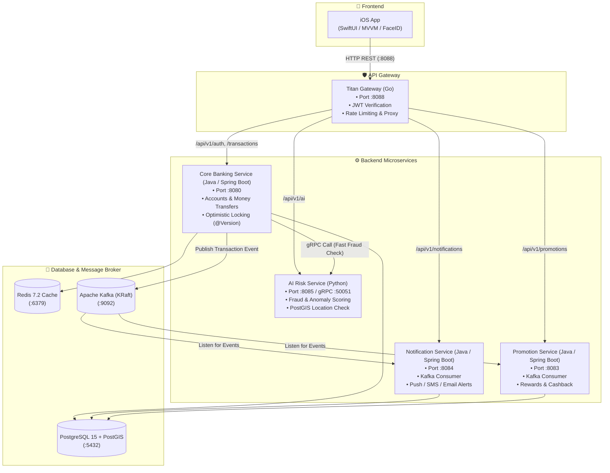
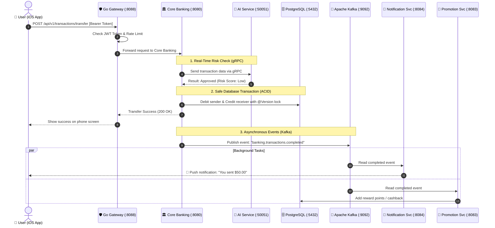

# 🏛️ Titan Banking — Full-Stack Distributed Microservices & iOS Banking App

<div align="center">

[](https://openjdk.org/projects/jdk/21/)
[](https://spring.io/projects/spring-boot)
[](https://golang.org/)
[](https://python.org/)
[](https://swift.org/)
[](https://kafka.apache.org/)
[](https://grpc.io/)
[](https://www.postgresql.org/)
[](https://redis.io/)
[](https://docker.com/)

**A full-stack distributed banking system built to practice microservices architecture, event-driven streaming with Kafka, real-time AI fraud detection with gRPC, and a native iOS client in SwiftUI.**

[About The Project](#-about-the-project) • [Architecture](#-system-architecture) • [Microservices Overview](#-microservices-overview) • [How It Works](#-how-it-works-step-by-step) • [iOS App](#-native-ios-banking-app) • [Quick Start](#-quick-start--how-to-run) • [API Testing](#-api-quick-test) • [What I Learned](#-what-i-learned--technical-decisions)

</div>

---

## 📌 About The Project

Hi! 👋 This is my portfolio project, **Titan Banking**. I built this system to learn and demonstrate how modern distributed applications work in practice. 

Instead of building a simple monolithic backend, I wanted to explore how real-world fintech platforms handle high traffic, money safety, asynchronous events, and mobile integration.

### What this project does:
- 🛡️ **API Gateway (Go)**: Fast entry point that handles user authentication (JWT), rate limiting, and routes requests to the right microservice.
- 💳 **Core Banking (Java 21 / Spring Boot 3)**: Manages customer accounts, balance transfers, transaction history, and publishes events.
- 🧠 **AI Risk & Fraud Detection (Python / gRPC)**: Checks transactions in real time using machine learning and geographic distance analysis before approving payments.
- 🔔 **Notification Service (Java 21 / Spring Boot 3)**: Listens to Kafka events to send transaction alerts (Push/SMS/Email).
- 🎁 **Promotion Service (Java 21 / Spring Boot 3)**: Listens to Kafka events to automatically award reward points and cashback.
- 📦 **Shared Kafka Library (Java 21 Maven Lib)**: A reusable module I built with custom annotations to easily consume Kafka events and handle errors with a Dead Letter Queue (DLQ).
- 📱 **Native iOS App (SwiftUI)**: A mobile banking app with biometric login (Face ID/Touch ID), transfers, and QR code payments.

---

## 📐 System Architecture

Here is the high-level design of how all the services talk to each other:



---

## 🗂️ Microservices Overview

| Service Name | Tech Stack | Port | Purpose |
| :--- | :--- | :--- | :--- |
| **`Titan-gateway-go`** | Go 1.22 | `8088` | Validates JWT tokens, applies rate limits, and proxies requests to backend services. |
| **`Titan-core-bank`** | Java 21, Spring Boot 3 | `8080` | Handles business logic for accounts, deposits, transfers, and database transactions. |
| **`titan-ai-service`** | Python 3.11, FastAPI, gRPC | `8085`, `50051` | Evaluates fraud risk using Python and communicates back to Core Banking via high-speed gRPC. |
| **`Titan-notifications-service`**| Java 21, Spring Boot 3 | `8084` | Consumes Kafka events asynchronously to trigger alerts for users. |
| **`Titan-promotions-service`** | Java 21, Spring Boot 3 | `8083` | Consumes Kafka events to calculate cashback and points without slowing down transfers. |
| **`titan-event-consumer-lib`** | Java 21, Spring Kafka | Shared Lib | Reusable library I created for Kafka consumer setup, retries, and error handling. |
| **`Titan-frontend-ios`** | Swift 5.9, SwiftUI | iOS Simulator | Native mobile app UI with Face ID / Touch ID and clean MVVM structure. |

---

## 🔄 How It Works (Step-by-Step)

Here is what happens behind the scenes during a money transfer:



---

## 📱 Native iOS Banking App

The mobile frontend is built purely with **SwiftUI** for iOS:

- **MVVM Pattern**: Keeps views clean by separating UI from business logic and network calls.
- **Modern Concurrency**: Uses Swift `async/await` for smooth network requests without freezing the UI.
- **Biometric Authentication**: Uses `LocalAuthentication` framework for **Face ID / Touch ID** login.
- **Secure Token Storage**: JWT tokens are safely stored in **Apple Keychain**, not in `UserDefaults`.
- **Features**: Live balance cards, transaction history, send money form, and QR code scanner.

---

## 🚀 Quick Start — How to Run

### 1. Prerequisites
- **Java 21** & **Maven 3.9+**
- **Docker & Docker Compose** (or Colima on Mac)
- **Xcode** (optional, to run the iOS app)

### 2. Build Java Microservices
All Java services are managed together using a root Maven `pom.xml`:
```bash
# Clone the repository
git clone https://github.com/your-username/Microservice-Titan.git
cd Microservice-Titan

# Build all modules with Maven
mvn clean install -DskipTests
```

### 3. Start Everything with Docker Compose
Run one command to start PostgreSQL, Redis, Kafka, and all microservices:
```bash
docker compose up -d --build
```

### 4. Check If Everything Is Running
```bash
docker ps
```

| Service Endpoint | URL | Expected Status |
| :--- | :--- | :--- |
| **API Gateway** | `http://localhost:8088/health` | `{"status":"UP"}` |
| **Core Banking** | `http://localhost:8080/actuator/health` | `{"status":"UP"}` |
| **AI Risk Engine** | `http://localhost:8085/health` | `{"status":"ok"}` |
| **Notifications** | `http://localhost:8084/actuator/health` | `{"status":"UP"}` |
| **Promotions** | `http://localhost:8083/actuator/health` | `{"status":"UP"}` |

### 5. Run the iOS App (Optional)
Open `Titan-frontend-ios/Titan_Banking.xcodeproj` in **Xcode**, choose **iPhone 17 Pro Max** (or any simulator), and click **Run (Cmd + R)**.

---

## 🧪 API Quick Test

You can test the whole system using `curl` from your terminal:

### 1. Register a New User
```bash
curl -s -X POST http://localhost:8088/api/v1/auth/register \
  -H "Content-Type: application/json" \
  -d '{
    "firstName": "Chhay",
    "lastName": "Dev",
    "username": "chhay_user",
    "email": "chhay@example.com",
    "password": "Password123!",
    "pin": "123456"
  }'
```

### 2. Login & Get JWT Token
```bash
curl -s -X POST http://localhost:8088/api/v1/auth/login \
  -H "Content-Type: application/json" \
  -d '{
    "username": "chhay_user",
    "password": "Password123!"
  }'
```
*Copy the returned `token` to use in authenticated endpoints.*

---

## 💡 What I Learned & Technical Decisions

| What I Used | Why I Chose It | What I Learned |
| :--- | :--- | :--- |
| **Go for Gateway** | Go is super lightweight, starts instantly, and uses very little memory compared to Java for pure proxying. | How to build reverse proxies, handle CORS, and implement sliding-window rate limiters in Go. |
| **gRPC for AI Service** | The Core Banking service needs a fast answer from Python before finishing a transfer. gRPC uses binary HTTP/2, which is faster than regular REST. | How to define `.proto` files, generate Python/Java code, and call gRPC stubs. |
| **Apache Kafka** | I didn't want notifications or rewards to slow down money transfers. If notifications fail, the transfer should still succeed. | How event-driven systems work, consumer groups, offset commits, and Dead-Letter Queues (DLQ). |
| **Optimistic Locking (`@Version`)** | Prevents race conditions and double-spending if a user submits two transfer requests at the exact same millisecond. | How JPA manages concurrency versions and avoids dirty writes in database records. |
| **Custom Maven Library** | Avoided copying and pasting Kafka listener configuration code between Spring Boot services. | How to package reusable Java libraries and configure Maven parent POM modules. |

---

## 📬 Contact & Feedback

Thanks for checking out my project! If you have any suggestions, feedback, or questions about the code, feel free to connect with me:

- **Developer**: Chhay
- **Project**: Titan Banking Portfolio
- **GitHub**: [github.com/your-username](https://github.com/)

---

<div align="center">
  <sub>Made with dedication to learn and build real-world distributed systems.</sub>
</div>
